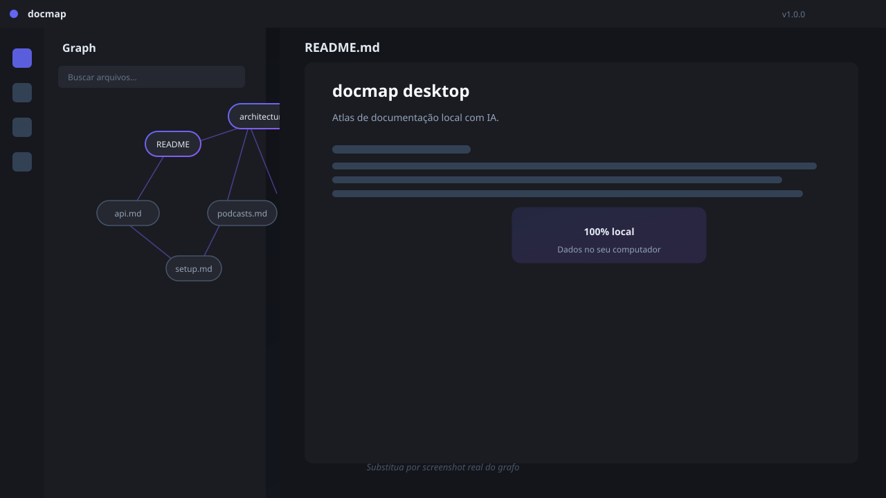
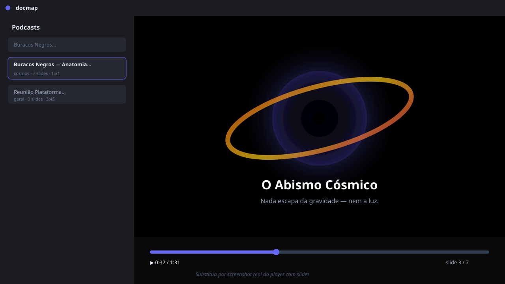
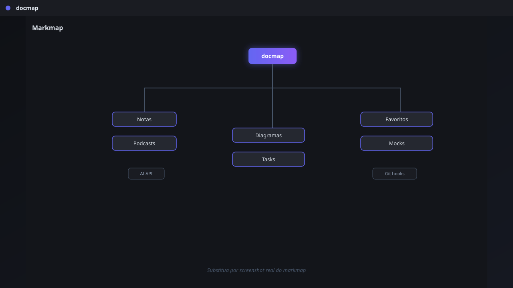
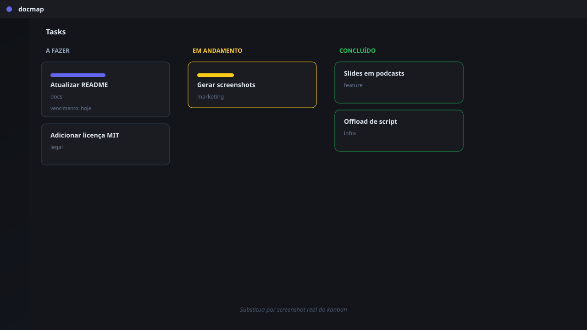

<div align="center">
  
  <h1>docmap desktop</h1>
  <p>
    <strong>Atlas de documentação local com IA.</strong><br>
    Conecte seus arquivos <code>.md</code>, capture ideias, ilustre com diagramas,
    organize tarefas e transforme qualquer conteúdo em podcasts com slides —
    <strong>100% offline, 100% sob seu controle</strong>.
  </p>

  <p>
    <a href="https://github.com/gustavosoriano/docmap/releases"></a>
    <a href="LICENSE"></a>
    <a href="https://deno.land"></a>
    <a href="https://github.com/gustavosoriano/docmap/stargazers"></a>
  </p>
</div>

---

## Por que docmap?

A maioria das ferramentas de documentação depende da nuvem: seus arquivos, suas ideias e seu histórico ficam em servidores que você não controla. O **docmap** inverte isso: tudo roda localmente — o grafo, as notas, os diagramas, os podcasts e a própria IA (via Ollama local ou provedores compatíveis). Sem assinaturas, sem lock-in, sem depender de uma conexão.

Ideal para:

- **Engenheiros e PMs** que querem mapear bases de código, RFCs e documentação de produto
- **Estudantes e pesquisadores** que estudam com conteúdo longo e precisam de podcasts gerados por IA
- **Times técnicos** que precisam de um hub local de conhecimento, mock servers, favoritos e kanban
- **Criadores de conteúdo** que querem transformar textos em episódios de áudio com slides visuais

---

## O que ele faz

| Módulo | O que resolve |
|--------|---------------|
| **🕸️ Grafo de arquivos** | Visualiza automaticamente os links entre seus arquivos `.md` do workspace |
| **🧠 Markmap** | Transforma headings em mapa mental navegável |
| **📝 Notas globais** | Knowledge base com busca full-text, categorias e tags |
| **📊 Diagramas Mermaid** | Cria diagramas de arquitetura direto no app |
| **🎙️ Podcasts com IA** | Gera áudio com 2+ vozes a partir de texto ou roteiro |
| **🎬 Slides sincronizados** | CSS art puro animado que troca conforme o áudio avança |
| **✅ Kanban de tarefas** | Organize tarefas e vincule a notas |
| **🔖 Favoritos** | Bookmarks inteligentes com tags, categorias e contador de acesso |
| **🧪 Mocks HTTP** | Servidor local de mocks para testar integrações |
| **🤖 AI API** | Endpoint local para agentes e integrações próprias |
| **📦 GitHub Releases** | Auto-update: o app baixa novas versões sozinho |

---

## Capturas de tela

> 💡 Os placeholders abaixo são wireframes SVG. Substitua por screenshots reais em `docs/assets/` antes de divulgar.

<div align="center">
  
  <br><br>
  
  <br><br>
  
  &nbsp;
  
</div>

---

## Principais diferenciais

### 🔒 100% local
Seus dados vivem em um arquivo SQLite no seu computador:

- macOS: `~/Library/Application Support/docmap/data.sqlite3`
- Linux: `~/.local/share/docmap/data.sqlite3`
- Windows: `%APPDATA%\docmap\data.sqlite3`

O caminho é fixo e independente do binário: atualizar o app nunca apaga suas notas.

### 🤖 IA onde você escolher
Use **Ollama** local (padrão, sem custo, sem internet) ou conecte a provedores compatíveis como DeepSeek. A chave de API nunca sai do backend.

### 🎙️ Podcasts + slides
A única ferramenta open-source que transforma texto em episódio de áudio com **slides visuais sincronizados**, tudo em CSS art puro. Pause, acelere, volte: os slides seguem o tempo do áudio naturalmente.

### 🧩 Extensível via API
A porta `:3334` expõe uma API REST para agentes. Integrações próprias podem criar notas, diagramas, tasks, favoritos e podcasts programaticamente.

### 🚀 Auto-update transparente
Binários são distribuídos via GitHub Releases. O app detecta novas versões e atualiza sozinho — sem loja, sem gatekeeper.

---

## Stack técnica

- **Runtime:** [Deno](https://deno.land) (TypeScript strict)
- **Desktop:** [webview_deno](https://deno.land/x/webview) — janela nativa via WebKit/WebView2
- **Persistência:** [Deno KV](https://deno.land/kv) — SQLite embutido
- **Frontend:** Vanilla JS, D3.js + markmap, CSS puro
- **TTS:** edge-tts (offline-friendly)
- **Áudio:** ffmpeg / ffprobe
- **Build:** compilação nativa com `deno compile`

---

## Comece agora

### 1. Requisitos

- [Deno](https://deno.land/#installation) instalado
- Para podcasts: `edge-tts` (`pip install edge-tts`) e `ffmpeg` (`brew install ffmpeg`)

### 2. Clone e rode

```bash
git clone https://github.com/gustavosoriano/docmap.git
cd docmap
deno task dev
```

### 3. Instale como app (macOS)

```bash
./install.sh
```

Isso cria `DocMap.app` em `/Applications` e registra o comando `docmap` no terminal.

### 4. Compile um binário

```bash
deno task build
mv docmap-app docmap-macos-aarch64
```

---

## Lançar uma nova versão

O app se atualiza sozinho lendo os GitHub Releases do repositório configurado.

1. Ajuste a versão em `src/config.ts`:
   ```ts
   export const APP_VERSION = '1.1.0';
   ```
2. Compile e renomeie o binário:
   ```bash
   deno task build
   mv docmap-app docmap-macos-aarch64
   ```
3. Crie o release:
   ```bash
   gh release create v1.1.0 docmap-macos-aarch64 \
     --title "v1.1.0" \
     --notes "Descrição das mudanças"
   ```

Na próxima vez que o app abrir, ele detecta a nova versão e atualiza automaticamente.

> Veja [README-RELEASE.md](README-RELEASE.md) para detalhes completos de release multiplataforma.

---

## Arquitetura e contribuição

- Princípios, estrutura de módulos e antipatterns: [CLAUDE.md](CLAUDE.md)
- Guia de API para agentes: [SKILL.md](SKILL.md)

Contribuições são bem-vindas! Abra uma issue, envie um PR ou sugira uma nova funcionalidade.

---

## Licença

Distribuído sob licença **MIT**. Veja [LICENSE](LICENSE) para o texto completo.

Use, modifique e venda sem burocracia. O código é seu.

---

<p align="center">
  Feito com carinho por <a href="https://github.com/gustavosoriano">@gustavosoriano</a>
</p>
