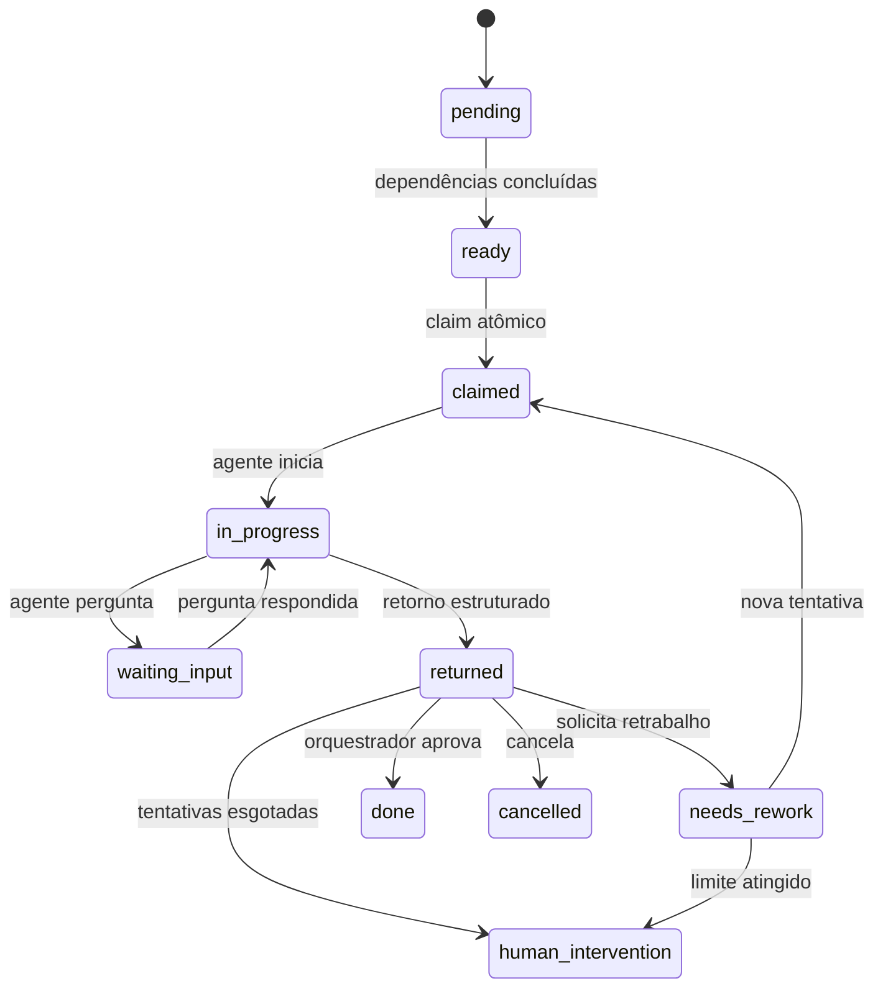
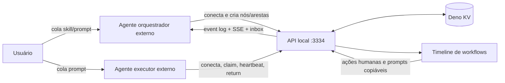

# Workflows de agentes externos

## Decisão central

O Docmap é o plano de coordenação. Ele não inicia Claude Code, Codex, opencode
ou qualquer outro processo e não chama LLM para orquestrar. O usuário abre os
agentes manualmente, cola a skill/prompt e cada agente se conecta à API local,
declara sua identidade e pega trabalho.

O Kanban existente continua independente. Um workflow pode citar notas, skills e
arquivos como contexto, mas não precisa estar ligado a uma task do Kanban.

## Entidades

### Workflow

Representa a demanda principal.

- `id`, `title`, `objective`, `description`, `tags`
- `status`:
  `draft | planning | running | reviewing | blocked | done | cancelled`
- `conflictPolicy`: `warn | block`
- `defaultMaxAttempts`
- `orchestrationSessionId`
- timestamps e resumo final

### WorkflowNode

Unidade de trabalho exibida como card no board Kanban do workflow.

- descrição e critérios de aceite explícitos
- `contextRefs`: notas, arquivos, skills, URLs ou texto
- complexidade `xs | s | m | l | xl` e tipo de trabalho
- capacidades exigidas e recomendação de ferramenta/provider/model
- escopos de leitura/escrita e estratégia de isolamento
- limite e contador de tentativas
- posição opcional legada, preservada apenas por compatibilidade

As dependências são representadas por `WorkflowEdge`. Ao entregar um nó ao
agente, a API inclui também os resultados aprovados das dependências.

### WorkflowEdge

Liga dois nós. O tipo `blocks` impede o destino de ficar pronto até a origem
estar concluída. Outros tipos (`informs`, `reviews`, `rework_of`) preservam a
semântica do fluxo sem bloquear execução.

### AgentSession

Criada quando um agente chama `POST /agents/connect`.

- nome da sessão
- ferramenta, provider e modelo
- papel `orchestrator | executor | reviewer`
- capacidades
- presença (`online | idle | busy | stale | offline`)
- heartbeat e trabalho atual

### WorkflowRun

Uma tentativa de execução de um nó. Guarda agente, ambiente/worktree informado
pelo agente, timestamps, resultado estruturado, logs, arquivos alterados, diff,
testes e decisão de revisão.

### WorkflowEvent e WorkflowQuestion

O event log é append-only e persistido. Perguntas permitem pausar um nó e
registrar uma resposta do orquestrador sem perder a execução.

## Estados do nó



O executor nunca marca o nó como concluído. `POST .../return` produz o estado
`returned` e o evento persistido `node.returned`. O orquestrador consulta
`GET /orchestrator/inbox` ou recebe o evento por SSE e registra a decisão.

## Fluxo



## Contratos externos

O agente se identifica com:

```json
{
  "name": "codex-backend-1",
  "tool": "codex-cli",
  "provider": "openai",
  "model": "gpt-5-codex",
  "role": "executor",
  "capabilities": ["code", "deno", "tests"]
}
```

O retorno de uma execução usa:

```json
{
  "agentSessionId": "...",
  "outcome": "success",
  "summary": "Implementação concluída",
  "result": "Detalhes relevantes para o revisor",
  "logs": ["deno task check: ok"],
  "changedFiles": ["src/example.ts"],
  "diff": "...",
  "tests": [{ "command": "deno task check", "status": "passed" }],
  "artifacts": []
}
```

Quando o usuário executa uma subdemanda manualmente pela UI, o Docmap usa
`POST /workflows/nodes/:id/human-return` com o mesmo contrato de evidências, mas
sem `agentSessionId`. Isso cria uma sessão sintética `docmap-ui · human ·
manual`, registra uma tentativa e move o nó para `returned`; a aprovação continua
com o orquestrador/revisor.

## Concorrência e código

O orquestrador decide a decomposição, dependências e distribuição entre modelos.
O Docmap aplica regras determinísticas:

- claim atômico impede dois agentes no mesmo nó;
- arestas `blocks` serializam nós dependentes;
- `writeScopes` sobrepostos geram aviso ou bloqueio conforme o workflow;
- nós de código podem exigir `worktree`, mas a criação e uso da worktree ficam a
  cargo do agente externo;
- heartbeat não libera automaticamente uma execução: sessão stale fica visível e
  a liberação é uma decisão explícita, evitando trabalho duplicado.

## Contrato do orquestrador

O orquestrador é um agente externo de controle, não de execução. Ele não faz
claim de nó executor, não cria branch/worktree, não roda testes, não edita
arquivos e não registra retorno de execução. Quando precisar de validação
prática, ele cria uma nova subdemanda de revisão ou pede retrabalho.

A forma determinística de saber que algo terminou é consultar
`GET /orchestrator/inbox?agentSessionId=...`. A resposta inclui
`pollAfterSeconds`; o orquestrador deve manter o ciclo
`heartbeat -> inbox ->
decisão -> espera -> inbox` até concluir, cancelar ou
bloquear o workflow.

## Atualização da interface

O modo `Workflows` possui lista de demandas, board Kanban por status dos nós,
agentes conectados ao workflow aberto e modal de detalhes do card. Os cards
mostram estado, complexidade, tipo, tentativas, dependências e identidade do
agente. Nós disponíveis ou em retrabalho têm ação de retorno humano, que envia o
card para revisão sem marcá-lo como concluído. Prompts para orquestrador,
executor e nó específico são gerados pelo servidor para permanecerem
sincronizados com a API.

O conteúdo servido em `GET /system/skill`, o botão global **Copiar skill** e o
prompt de sistema da IA integrada usam a mesma fonte canônica.
