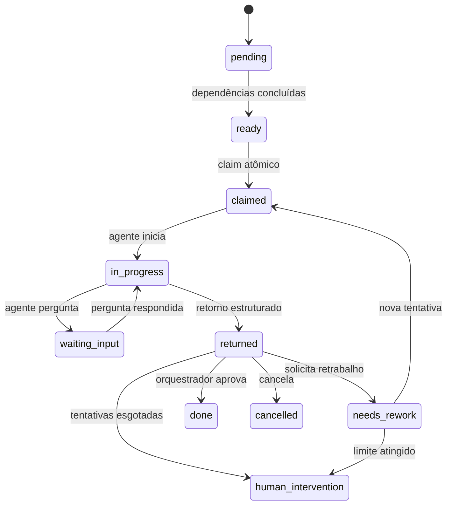
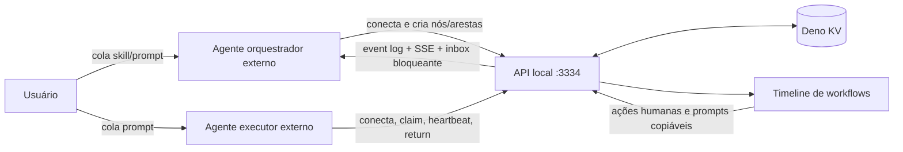

# Workflows de agentes externos

## Decisão central

O Docmap é o plano de coordenação. Ele não inicia Claude Code, Codex, opencode
ou qualquer outro processo e não chama LLM para orquestrar. O usuário abre os
agentes manualmente, cola a skill/prompt e cada agente se conecta à API local,
declara sua identidade e pega trabalho.

O Kanban existente continua independente. Um workflow pode citar notas, skills e
arquivos como contexto, mas não precisa estar ligado a uma task do Kanban.

## Entidades

### Workflow

Representa a demanda principal.

- `id`, `title`, `objective`, `description`, `tags`
- `status`:
  `draft | planning | running | reviewing | blocked | done | cancelled`
- `conflictPolicy`: `warn | block`
- `defaultMaxAttempts`
- `completionPolicy`: quality gate e auditoria final obrigatórios por padrão
- `orchestrationSessionId`
- timestamps e resumo final

### WorkflowNode

Unidade de trabalho exibida como card no board Kanban do workflow.

- descrição e critérios de aceite explícitos
- `contextRefs`: notas, arquivos, skills, URLs ou texto
- complexidade `xs | s | m | l | xl` e tipo de trabalho
- capacidades exigidas e recomendação de ferramenta/provider/model
- escopos de leitura/escrita e estratégia de isolamento
- limite e contador de tentativas
- posição opcional legada, preservada apenas por compatibilidade

As dependências são representadas por `WorkflowEdge`. Ao entregar um nó ao
agente, a API inclui também os resultados aprovados das dependências.

### WorkflowEdge

Liga dois nós. O tipo `blocks` impede o destino de ficar pronto até a origem
estar concluída. Outros tipos (`informs`, `reviews`, `rework_of`) preservam a
semântica do fluxo sem bloquear execução.

### AgentSession

Criada quando um agente chama `POST /agents/connect`.

- nome da sessão
- ferramenta, provider e modelo
- papel `orchestrator | executor | reviewer`
- capacidades
- presença (`online | idle | busy | stale | offline`)
- heartbeat e trabalho atual

### WorkflowRun

Uma tentativa de execução de um nó. Guarda agente, ambiente/worktree informado
pelo agente, timestamps, resultado estruturado, logs, arquivos alterados, diff,
testes e decisão de revisão.

### WorkflowEvent e WorkflowQuestion

O event log é append-only e persistido. Perguntas permitem pausar um nó e
registrar uma resposta do orquestrador sem perder a execução.

## Estados do nó



O executor nunca marca o nó como concluído. `POST .../return` produz o estado
`returned` e o evento persistido `node.returned`. O orquestrador consulta
`GET /orchestrator/inbox?agentSessionId=...&wait=55` ou recebe o evento por SSE
e registra a decisão.

Depois do retorno, o executor continua conectado pela inbox bloqueante
`GET /agents/:id/inbox?workflowId=...&wait=55`. O campo `nextAction` direciona
`await_review`, `rework`, `claim_next`, `capability_mismatch`, `wait` ou `stop`.
Retrabalho fica reservado ao executor original enquanto sua sessão estiver
ativa; após desconexão ou staleness volta ao pool compatível.

## Fluxo



O ciclo completo do executor é:

`inbox -> claim -> start -> execute -> validate -> return -> await review ->
rework ou checkpoint/compact -> inbox`.

## Contratos externos

O agente se identifica com:

```json
{
  "name": "codex-backend-1",
  "tool": "codex-cli",
  "provider": "openai",
  "model": "gpt-5-codex",
  "role": "executor",
  "capabilities": ["code", "deno", "tests"]
}
```

O retorno de uma execução usa:

```json
{
  "agentSessionId": "...",
  "outcome": "success",
  "summary": "Implementação concluída",
  "result": "Detalhes relevantes para o revisor",
  "logs": ["deno task check: ok"],
  "changedFiles": ["src/example.ts"],
  "diff": "...",
  "tests": [{ "command": "deno task check", "status": "passed" }],
  "artifacts": []
}
```

Quando o usuário executa uma subdemanda manualmente pela UI, o Docmap usa
`POST /workflows/nodes/:id/human-return` com o mesmo contrato de evidências, mas
sem `agentSessionId`. Isso cria uma sessão sintética
`docmap-ui · human ·
manual`, registra uma tentativa e move o nó para
`returned`; a aprovação continua com o orquestrador/revisor.

## Concorrência e código

O orquestrador decide a decomposição, dependências e distribuição entre modelos.
O Docmap aplica regras determinísticas:

- claim atômico impede dois agentes no mesmo nó;
- arestas `blocks` serializam nós dependentes;
- `writeScopes` sobrepostos geram aviso ou bloqueio conforme o workflow;
- nós de código podem exigir `worktree`, mas a criação e uso da worktree ficam a
  cargo do agente externo;
- heartbeat não libera automaticamente uma execução: sessão stale fica visível e
  a liberação é uma decisão explícita, evitando trabalho duplicado.
- consultas à inbox renovam a presença da sessão, evitando que um agente ativo
  apareça como stale apenas por esquecer uma chamada separada de heartbeat;

### Capacidades e afinidade ao workflow

`requiredCapabilities` usa correspondência estrita: um executor só enxerga um nó
se sua sessão declarou todas as capacidades exigidas. Para impedir que o prompt
padrão esconda trabalho válido:

- o prompt copiável do workflow declara a união das capacidades de seus nós;
- o prompt específico de nó declara exatamente as capacidades daquele nó;
- a inbox aceita `workflowId` para não oferecer trabalho de outra demanda;
- quando há nó pronto, mas incompatível, a inbox retorna
  `nextAction=capability_mismatch`, as `missingCapabilities` e os nós filtrados.

Assim, ausência real de trabalho e incompatibilidade de executor são estados
distintos e observáveis. O executor só deve reconectar com capacidades que sua
ferramenta realmente possui.

### Espera dirigida por eventos

As duas inboxes aceitam `wait=<segundos>`, limitado pelo servidor a 120
segundos. O padrão recomendado para agentes é 55 segundos:

- `GET /agents/:id/inbox?workflowId=...&wait=55`;
- `GET /orchestrator/inbox?agentSessionId=...&compact=true&wait=55`.

Se já houver uma ação, a resposta é imediata. Caso contrário, o servidor mantém
a requisição aberta e desperta quando um evento pode alterar a inbox. Após
despertar, a inbox persistida é recalculada; eventos são apenas o sinal, nunca a
fonte da verdade. Um contador e um buffer curto de eventos fecham a janela de
corrida entre ler o estado e registrar a espera.

A resposta bloqueante inclui `wait.reason` (`actionable`, `timeout` ou
`aborted`), `wait.trigger` e `wait.waitedMs`. Em timeout, o cliente repete a
chamada imediatamente. Isso mantém o processo aguardando sem gastar uma
inferência de LLM nem executar ciclos de sleep. O campo `pollAfterSeconds`
continua no payload para compatibilidade com clientes que não suportam
requisições bloqueantes.

## Fechamento e barreiras

Novos workflows exigem:

1. um nó `quality_gate`, criado depois do trabalho normal e dependente de todas
   as folhas relevantes;
2. um nó `final_audit`, ligado por `blocks` ao quality gate.

`POST /workflows/:id/final-barriers` cria ou reutiliza essas barreiras de forma
idempotente, identifica as folhas do DAG e garante as arestas
`folhas -> quality_gate -> final_audit`. Assim o modelo não precisa montar
vários payloads JSON e IDs manualmente.

O quality gate executa verificações automatizadas sem alterar código. A
auditoria final é independente e cobre qualidade, bugs, crashes, edge cases,
regressões, segurança, mudanças fora do escopo e riscos residuais. Se surgir
remediação depois das barreiras, um novo par deve ser criado.

`completionReadiness` explica por que o workflow ainda não pode concluir. Nós
cancelados, perguntas abertas, barreiras ausentes/incompletas ou barreiras mais
antigas que o último trabalho impedem o fechamento.

Uma decisão `approve` ou `expand` também precisa registrar `acceptanceChecks`
para todos os critérios do nó. Cada item usa o texto exato do critério,
`status: pass` e evidência observável; a avaliação fica persistida no run e no
evento de revisão. Gate e auditoria só aceitam aprovação com `outcome=success`.
O pacote compacto de revisão fornece `decisionRequest` já preenchido com os
textos exatos, e a criação de nós rejeita critérios que não sejam strings.

Macros agregadoras podem usar `lifecycle: workflow` e `workflowId`. Ao concluir,
o servidor arquiva script, SHA-256 e metadados em
`GET /workflows/:id/macro-archives` e remove a macro ativa.

## Contrato do orquestrador

O orquestrador é um agente externo de controle, não de execução. Ele não faz
claim de nó executor, não cria branch/worktree, não roda testes, não edita
arquivos e não registra retorno de execução. Quando precisar de validação
prática, ele cria uma nova subdemanda de revisão ou pede retrabalho.

A forma determinística de saber que algo terminou é consultar
`GET /orchestrator/inbox?agentSessionId=...&compact=true&wait=55`. A própria
consulta renova a presença e espera no servidor quando não há ação. O
orquestrador deve processar `nextActions` por prioridade, drenando revisões
antes de expandir o plano, e manter o ciclo
`inbox bloqueante -> decisão -> inbox bloqueante` até concluir, cancelar ou
bloquear o workflow.

Para reduzir tokens, o orquestrador usa `GET /workflows/:id?view=planning`,
itens `nextActions` da inbox e `GET /workflows/nodes/:id?view=review`. Detalhe
completo, eventos, logs e diff são carregados somente quando o pacote compacto
não basta. O protocolo específico do papel está em
`GET /workflows/protocol?role=...`; agentes de workflow não precisam carregar a
skill global.

## Atualização da interface

O modo `Workflows` possui lista de demandas, board Kanban por status dos nós,
agentes conectados ao workflow aberto e modal de detalhes do card. Os cards
mostram estado, complexidade, tipo, tentativas, dependências e identidade do
agente. Nós disponíveis ou em retrabalho têm ação de retorno humano, que envia o
card para revisão sem marcá-lo como concluído. Prompts para orquestrador,
executor e nó específico são gerados pelo servidor para permanecerem
sincronizados com a API. O botão do orquestrador desaparece quando o workflow já
possui uma sessão de orquestração; prompts de executor e de nó continuam
copiáveis durante todo o fluxo. Se a sessão do orquestrador ficar `stale` ou
`offline`, a toolbar oferece uma ação explícita de liberação. Após confirmação,
o botão de copiar um novo prompt volta a aparecer.

O conteúdo servido em `GET /system/skill`, o botão global **Copiar skill** e o
prompt de sistema da IA integrada usam a mesma fonte canônica.
